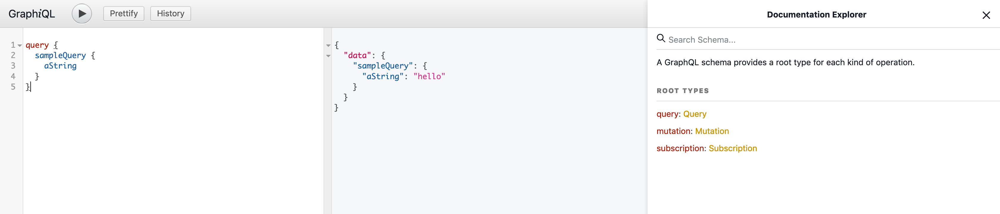

# A maze

here's a change

A [GraphQL](https://graphql.org/) api to solve mazes and learn some GraphQL doing it.

There are two main components to this project: the Maze api and a client to start a new game
or view existing ones.

## The api
The app exposes an api explorer at `<address where the app is deployed>/graphiql`, which lets you both browse
the queries/mutations/subscriptions available as well as test these, see below:

The api includes a simple query to get started with GraphQL - this is used in the starter kits to check that
you can connect to the api, query it and decode the responses correctly. 

### Player token
When you create a player to run in a maze, you are given a token in the response. This must be used when trying to take
a step in the maze with that player.

## The client
The client is a simple Elm app that lets you create new games and visualise existing ones. It is available at 
`<address where the app is deployed>/index.html`

## Starter kits
There are a few starter kits to get you using the api fast. Just `cd` into your starter kit of choice and follow the
instructions. If your favourite language is not there, then feel free to open a pull request to add it;
it would be ideal if all starter kits had:
- minimum dependencies
- clear instructions and prerequisites
- an example that integrates with the `sampleQuery` query of the api
- plain graphQL queries, without the use of client libraries
