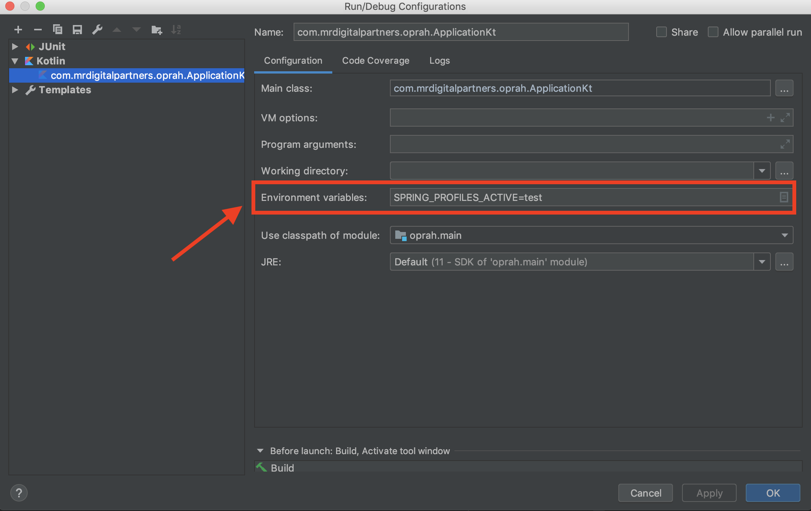
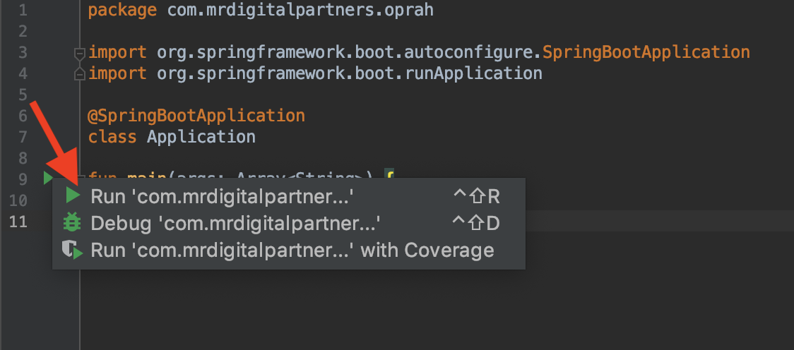

## Application properties
We use [Spring Boot properties](https://docs.spring.io/spring-boot/docs/current/reference/html/boot-features-external-config.html) to 
manage our application environment variables.
All properties are stored in the `application.yml` file, with the default properties at the top and specific environments
(also known as spring profiles) separated by three dashed (`---`).

One way to run the application in a specific environment is to set the `SPRING_PROFILES_ACTIVE` variable when running the 
app.

## Running the application
The two main ways you can run the app for development are using Gradle (our build tool of choice) or IntelliJ.

The app requires a relational database; you can choose to run it with Postgres, or H2 (in-memory database),
depending on which spring profile is used (see the [application properties](#application-properties) section for more info):

- the default profile requires a number of environment variables (`DB_HOST`, `DB_NAME`, `DB_USERNAME`, `DB_PASSWORD`)
to be available and refer to a running PostgreSQL instance

- `local-dev-h2` uses H2 (in-memory database)

- `local-dev-postgres` expects a PostgreSQL instance with the following attributes:
  + running on `localhost`
  + username `postgres`
  + no password
  + database name `oprah_dev`

### Running with gradle
You can use Gradle without installing it, using the wrapper.

```bash
SPRING_PROFILES_ACTIVE=<spring profile you want to use> ./gradlew bootRun
```


### Running with IntelliJ
Set the Spring profile you want to use under

```Run -> Edit Configurations... -> Kotlin -> Environment variables:```, like so:



Run the app from `Application.kt`:



## Linting
We use [ktlint](https://ktlint.github.io/) for linting. We have a gradle plugin to automatically run the linter and
format what it can:

```./gradlew ktlintFormat```

Linter errors will fail the build task.

If you are using IntelliJ, then apply the [following settings](https://github.com/pinterest/ktlint#option-2).


## Docker repository
The [GitLab pipeline](./.gitlab-ci.yml) is setup to build and push a docker image every time it runs.
The image is pushed to a repository in GitLab and the tag varies based on the branch it is built from:
for master we use the tag `latest`, whereas for any other branch we use `<branch-name>`.
This allows integration tests to either use the latest version of master or a branch.
